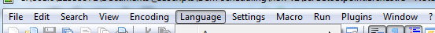
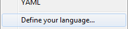
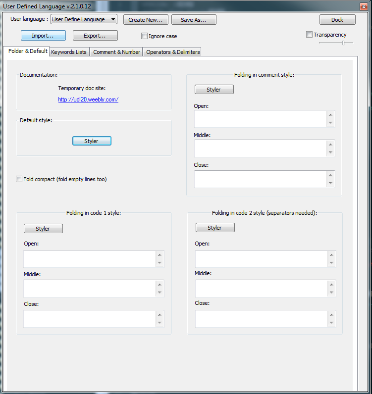
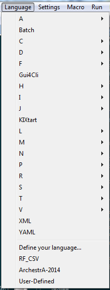

# Notepad++ ArchestrA Solarized syntax highlighting theme.  

## [Notepad++](https://notepad-plus-plus.org/) is an alterantive text editor with syntax highlighting.  
[This repository]() contain a syntax highlighting template for the ArchestrA scripting language.
This specific one is done according to the [solarized](http://ethanschoonover.com/solarized) dark theme which was scientifically worked out:  

Quote from the Solarized color scheme website from Ethan:  

 ```"Solarized is a sixteen color palette (eight monotones, eight accent colors) designed for use with terminal and gui applications. It has several [unique properties](http://ethanschoonover.com/solarized#features). I designed this colorscheme with both precise [CIELAB](http://en.wikipedia.org/wiki/Lab_color_space) lightness relationships and a refined set of hues based on fixed color wheel relationships. It has been tested extensively in real world use on color calibrated displays (as well as uncalibrated/intentionally miscalibrated displays) and in a variety of lighting conditions."``` - source http://ethanschoonover.com/solarized  

The ArchestrA theme will look something like this in Notepad++:  

<p align="center">
  
</p>

## Download and Installation

To begin using this theme, choose one of the following options to get started:
* Clone the repo: ```git clone https://github.com/RoanFourie/notepad-plus-plus-ArchestrA-theme.git```  
* [Fork, Clone, or Download on GitHub](https://github.com/RoanFourie/notepad-plus-plus-ArchestrA-theme.git)

## Usage

### Basic Usage
After downloading, simply import the file from within Notepad++.  
Click on "Language"  

<p align="center">
  
</p>

Click on "Define your language..."  

<p align="center">
  
</p>

Then on "Import"  

<p align="center">
  
</p>

Select the "ArchestrA_2014_Lang_Def.xml" file to be imported.

After the import, restart Notepad++ to let the theme take effect.  
You will see the extra language in the Language menu.  

<p align="center">
  
</p>

From there you can safe your scripts in text files with the ".archestra" extension.  


[Other Notepad++ themes](http://docs.notepad-plus-plus.org/index.php/User_Defined_Language_Files)
